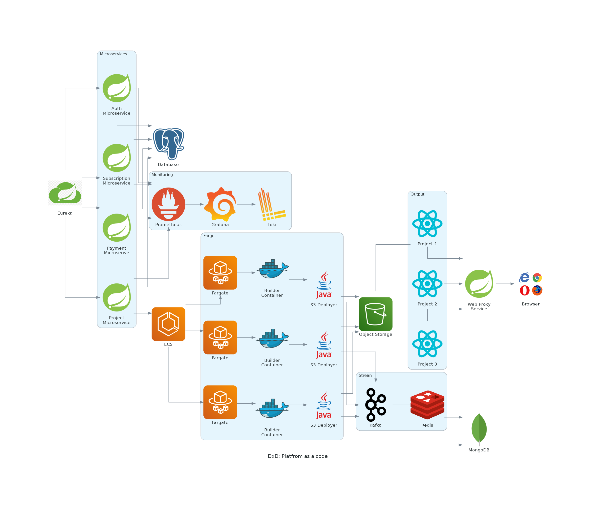
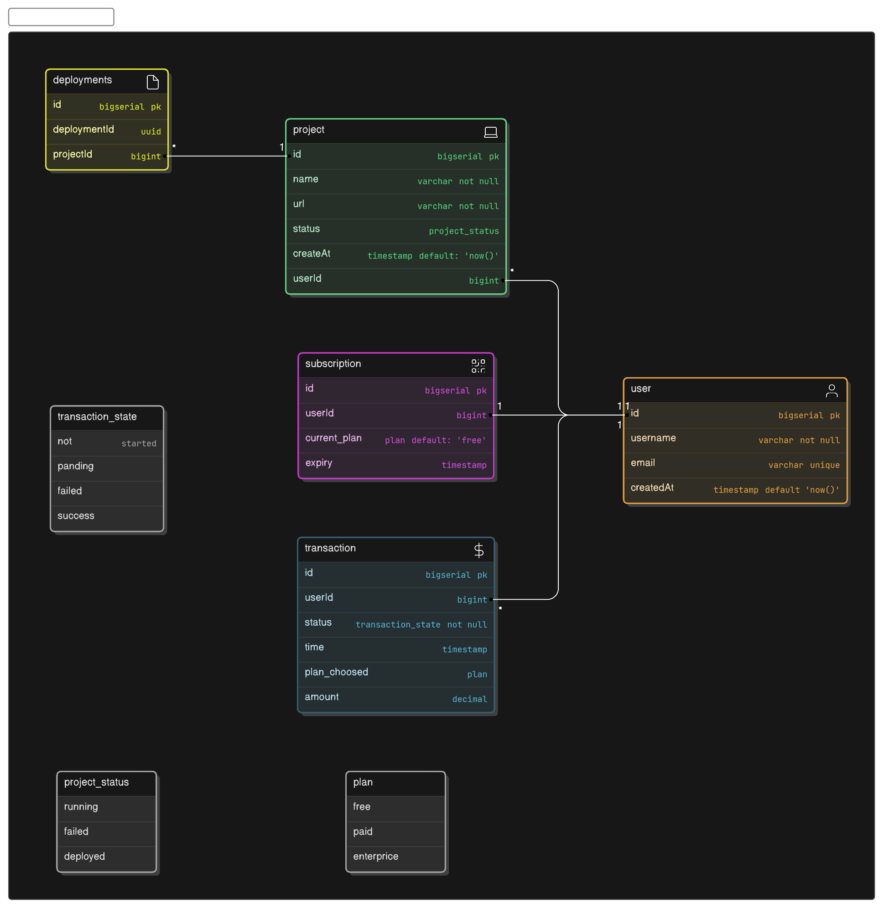

# DxD: Platform as a Service
DxD: Developer Experience Deployer is a cutting-edge Platform as a Service (PaaS) designed specifically for deploying React applications seamlessly to production environments.

## Tect Used

## Dependency
- JDK 17 LTS +
- Ansible-Avault
- Docker/Podman

## Architecture Design

## Entity Relationship Diagram

[Project Link](http://github.com/subrotokumar/dxd-paas)

## DEVELOPMENT Link:
- pgddmin: http://localhost:5050
- mongo-express: http://localhost:8081
- Eureka: http://localhost:8761